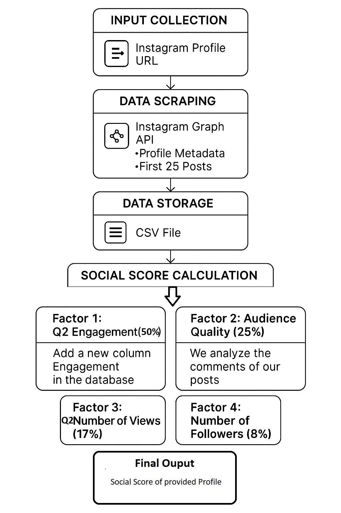

## 📊 **Flowchart Description: Instagram Profile Scraper & Social Score Calculator**

This flowchart outlines the system I’m building to **scrape Instagram profile data** and calculate a dynamic **Social Score** based on key performance indicators. The system is divided into several functional modules:

### 🕵️‍♂️ **1. Instagram Data Scraping Module**

* The process starts by inputting an **Instagram profile URL**.

* Objective: To **scrape data dynamically** and in a **scalable way**.

* ⚠️ **Current Status**:
  A scalable scraping solution is still under development. For now, I’m manually collecting sample data to test and build the next modules.

* ✅ **Target Data to Be Scraped**:

  * **Profile Metadata**:

    * 👤 Username
    * 👥 Number of followers
    * 🔁 Number of followings
    * 🖼️ Number of posts
  * **Latest 25 Posts**:

    * ❤️ Number of likes
    * 💬 Number of comments
    * 👀 Number of views
    * 🧠 Post comments (for sentiment analysis)

### 🧮 **2. Social Score Calculation Module**

Based on my research, the **Social Score** is calculated using **4 major factors**, each with a **custom weight** (adjustable in the future).

#### 1️⃣ **Engagement (Weight: 50%)**

* **Formula**:
  Engagement = ❤️ Likes + 💬 Comments (per post)
* **Process**:

  * Add a new **Engagement** column to the dataset.
  * Calculate the **Q2 (median)** value of that column for scoring.

#### 2️⃣ **Audience Quality (Weight: 25%)**

* Measures the **relevance and sentiment** of audience comments.

* **Approach**:

  * Use an advanced **LLM (Language Model)** to classify comments:

    * 😊 Positive
    * 😠 Negative
    * 🔇 Irrelevant (e.g., only emojis or spam)
  * Based on this, calculate how **genuine and meaningful** the audience is.

* 🔬 **Current Status**:
  Exploring and testing effective LLMs for accurate sentiment and relevance analysis.

#### 3️⃣ **Post Views (Weight: 17%)**

* Captures how many users are actually **watching the content**.
* **Method**:

  * Extract 👀 **view count** for each post.
  * Calculate the **Q2 (median)** of this data.

#### 4️⃣ **Followers (Weight: 8%)**

* Reflects the overall **reach or influence** of a profile.
* Pulled from the metadata and included directly in the final calculation.

### ✅ **Final Output: Social Score**

📈 The final **Social Score** is computed by combining all four factors using their respective weights. It reflects the **influence, engagement, and audience quality** of the profile.

### 🚧 **Work in Progress & Future Improvements**

* 🔄 **Scraping Module**: Actively working on a scalable, automated solution.
* 🧠 **Scoring Logic**: Weights and formulas will evolve as more data and insights are collected.
* ➕ **Future Scope**: More metrics may be added to enhance the score's accuracy and fairness.

### 🤝 **Looking for Contributions**

If you have knowledge about **scalable scraping techniques for Instagram** or ideas to improve this system, I would love your **guidance and collaboration**!
💻 Feel free to contribute to the project repository.
